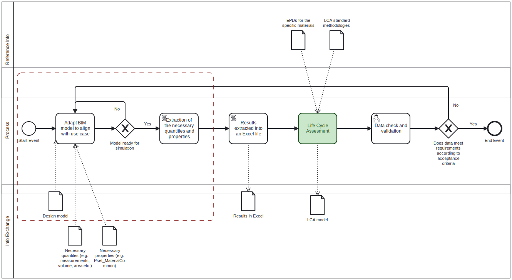

# A3-OpenBIM-ReModel
A3 OpenBIM ReModel in 41934 Advanced BIM course of DTU

# 41934 Advanced BIM - A3: OpenBIM ReModel

## Group 7
|Name|Study Number|
|----|------------|
|Emil Hjort Kristensen|S193924|
|Rasmus Olsen|S184506|

## Use Case
Our use case involves creating a tool capable of extracting data such as materials, quantities, and EPDs from a BIM model. The tool then compiles the data into a .json file that can be directly imported into LCAByg. The file contains all the relevant information so a sustainability engineer can initiate a building LCA. 

In short, the goal of the tool is described as the following:
Streamline the process of conducting a building LCA from a BIM model by compiling all the necessary data a sustainability engineer needs. 

## BIM Execution Plan
The formulation of a BIM Execution Plan (BEP) necessitates the inclusion of all delivery team members, ensuring a collaborative process in its preparation. This particular approach of information exchange will lead to great opportunities for innovation and also minimize unexpected surprises or unforeseen risks during the appointments.

While a comprehensive BEP between the different parties typically covers various topics such as information delivery strategy, high-level responsibility matrix, etc., our emphasis will center on the model use, process, and information exchange between the appointing and appointed parties.

### Model Use
In relation to the goal of streamlining the process of conducting a building LCA from a BIM model by providing all the necessary data to the sustainability engineer, a new tool needs to be created. Initially, an information extraction tool was developed to extract all required and possible quantities and properties from an IFC file for an LCA study, gathering the data into an Excel sheet for subsequent use in further LCA analysis. However, an issue can occur if the needed information has yet to be included in the IFC file, to begin with from the supplier of the file.

Therefore, to initiate this tool’s process and development, we endeavored to develop a tool capable of adding the “MaterialCommon” property set, specifying the mass density for concrete materials, and applying this to all walls in the IFC file constructed with concrete material. Moving forward, this tool would be expanded to include various mass densities for all kinds of materials and introduce multiple new property and quantity sets not yet present in any IFC file. In the following diagram, the process of these tools is displayed, with the current tool process marked with dotted lines along with the goal of the tools until the end event.

Exploring the tool’s future development, various additional features could be incorporated, aiming to enhance the efficiency of every LCA study implementing BIM in their processes.

One possible advancement for the tool could involve an integration of multiple data on material properties, specifically related to environmental impact such as carbon footprint, energy consumption, transportation distance, and more for each identified material within the IFC file. To add and extract this in an IFC file for a comprehensive building construction, would make the data collection for LCA studies much more efficient.

Another feature could involve the integration of relevant documentation and source information, such as EPDs, into each specific material within the IFC file. This enhancement would significantly streamline the process of accessing information for multiple materials. This would ensure that each material already has an attached specific EPD, for the sustainability engineer to use for further LCA studies necessary during the building construction.

### Process
This IDM diagram represents the envisioned procedure for our tool when fully developed for the specific use case of LCA. The diagram differs significantly from the previously presented diagram, as this one represents our envisioned tool and the other illustrates our attempt with limited coding skills. 

Initially, the BIM model must be prepared to correspond with the specific use case, which in this case is an LCA. This must be done by integrating input data including the design model, quantities, properties, and other relevant elements. When the model is ready for simulation the extraction of BIM data becomes feasible for analysis. Once all essential data is extracted into a .json file for LCA, the LCA process can be initiated using dedicated software such as LCAbyg. This software enables direct uploading and utilization of .json files for the LCA procedure. Once the results are checked and validated against the predefined acceptance criteria, the submission will undergo peer review and approval. If the submission meets these criteria, a finalized submission is prepared for the building owner.

Then the building owner needs a validation of the BIM LCA data input and results. If the BIM LCA data is invalid, it prompts a restart in the design team’s process. However, if the BIM LCA data is confirmed valid, the building owner must decide if it is necessary to engage a specialist for an approval check of the LCA. In such instances, the LCA data inputs will be provided to the LCA specialist initiating a process similar to that of the design team. Upon validation, another submission will be presented to the building owner.

Following the submission(s), the building owner evaluates the LCA results and provides feedback to the design team. Based on this feedback, the design team enhances the LCA where necessary, assessing whether the final acceptance criteria are met. Once these criteria are fulfilled, this procedure concludes. 

### Information Exchange
For our tool to work somewhat as intended, the BIM model is expected to have a level of detail equal to a minimum of LOD200. Before the tool can extract data, the elements in the model need some kind of quantity to be extracted, to begin with. When it comes to the tool’s envisioned intent, the BIM model needs to have an LOD of 300. 

Regarding the submitted script, we tried to increase the model’s LOD. The script relies on manual input, but it can potentially add property data to individual building elements, which would elevate the model’s LOD to 300, signifying an advancement to the design phase. At this stage, the BIM model would encompass defined elements, featuring quantities and properties.

What we had envisioned for the script was to elevate the model’s LOD to 400 or potentially even LOD500. The script would still need manual input, but the enhancement within the BIM model would involve integrating EPDs into the elements, providing comprehensive fabrication, assembly, and detailed information about the materials, thereby advancing the model to at least LOD400. Furthermore, the tool’s versatility extends to be used for the as-built phase, ensuring a representation of precise as-built conditions, including detailed data relevant to a building LCA.

In employing the tool, the utilization of standard LCA methodologies is essential for executing accurate LCA results. The most commonly used standards for LCA in Europe are ISO 14040 and ISO 14044, providing the principles and framework for conducting and reporting life cycle assessments.

To ensure the optimal distribution of information between the appointing and appointed parties during the different procedures, it is advantageous to employ the ISO 19650 standard for the ideal information exchange.

## The potential value offered by this tool
When formulating potential solutions for our use case, we considered the tool’s intended function, its overarching goal, and, most crucially, the value it brings. To describe the tool’s value, we will examine it through the eyes of an entrepreneur within a construction company, detailing the potential advantages it presents compared to the absence of such a tool. We will be describing the tool’s value from both a business and a societal standpoint. 

### Business Value
From a business standpoint, the tool offers two significant potential enhancements:

#### Time Efficiency
The tool becomes a time-saving asset by significantly reducing the efforts required for sustainability engineers to manually extract and compile the required data for a building LCA. The tool reduces the need for back-and-forth communication with BIM specialists or subcontractors to gather data on quantities, material usage, or EPDs. Not only would the tool boost productivity but also streamline the entire process, allowing the sustainability engineer/team to concentrate on more complex tasks, such as finding ways to optimize the LCA. 

#### Cost reduction/allocation of resources
By automating a previously time-consuming process of data gathering, the tool contributes to improved project efficiency by saving time on labor-intensive processes. A reduction in hours spent on menial tasks can translate into cost savings, especially in projects involving consultant work. A project’s budget is often limited in terms of how many hours can be spent on it, so a reduction in these processes can in return enable a lower expense or more commonly an allocation of resources to more important activities, such as making or improving the building LCA. This could in return help create a more efficient and cost-effective project environment.

### Societal Value
From a societal standpoint, the tool also offers a noteworthy enhancement:

#### Environmental impacts
As noted in the business value section, the tool’s ability to allocate more resources to the analysis and optimization of a building LCA could indirectly lead to a reduction in material waste and CO2 emissions, at a company level. For instance, this could include exploring solutions for concrete construction using less reinforcement compared to just using conventional solutions. This aligns with the objective of sustainability, actively contributing to the broader goal of minimizing the environmental impacts of construction projects.  

